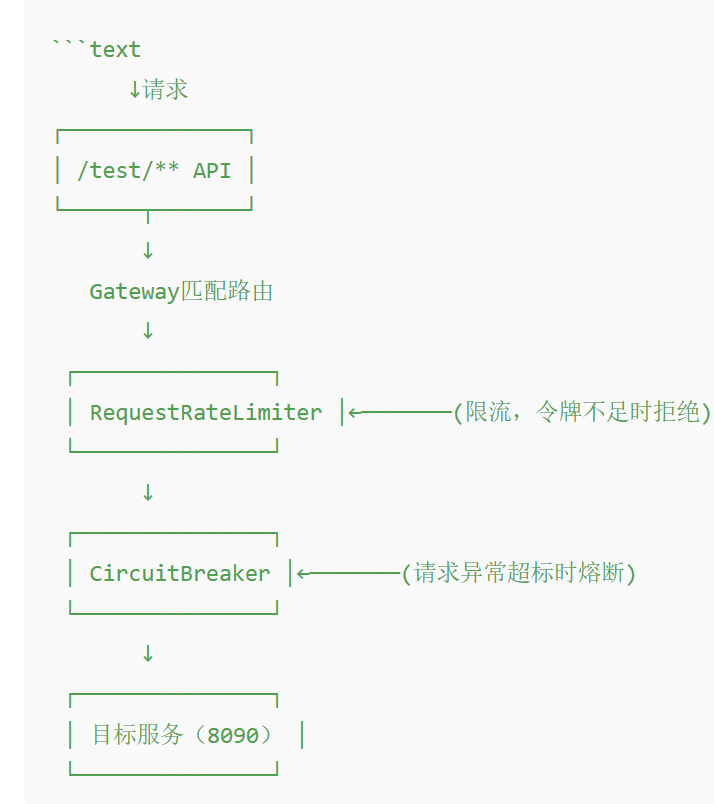

spring:
    cloud:
        gateway:
            routes:
                - id: test-service  ## 路由ID，路由唯一标识，可以自定义，用于监控管理
                # uri: lb://product-service # 如果使用 Eureka，使用 lb://service-id
                uri: http://localhost:8080/test  ##网关的目标地址，当请求匹配/test/**时，转发到这个目标url
                predicates:
                  - Path=/test/**  ## 断言，用于匹配请求路径，匹配成功则转发至uri指定的目标地址
                filters:
                  - name: CircuitBreaker  ## 熔断过滤器
                    args:
                      name: testCircuitBreaker  ## 熔断过滤器的逻辑名称，对应下面的resilience4j.circuitbreaker.instances.testCircuitBreaker
                      fallbackUri: forward:/fallback  ##当熔断器打开时，执行降级处理，会跳转到/fallback接口
                  - name: RequestRateLimiter
                    args:  # 限流：通过 RequestRateLimiter 实现，利用 Redis 配置令牌桶算法
                      redis-rate-limiter.replenishRate: 2   # 每秒放入令牌桶的令牌数量（即每秒允许请求的平均数）
                      redis-rate-limiter.burstCapacity: 5   # 令牌桶的最大容量（允许的突发的请求数）
                      key-resolver: "#{@ipKeyResolver}"     # 限流维度的key生成逻辑，这里指定了通过IP地址限流

resilience4j:
    circuitbreaker:
        instances:
            testCircuitBreaker:
                registerHealthIndicator: true    # 将熔断器暴露给Spring Boot Actuator的 '/actuator/health'
                slidingWindowSize: 5   # 滑动窗口大小：统计最近5个请求
                minimumNumberOfCalls: 5   # 触发熔断的前提条件：必须至少收到5个调用数据后才进行熔断判断，避免因样本太少产生误判
                failureRateThreshold: 50  # 失败率阈值：当滑动窗口内的请求失败比例超过50%时，熔断器打开。例如：5个请求中有3个失败（60%>50%），将触发熔断
                waitDurationInOpenState: 5s # 熔断器打开后处于打开状态的时间，5秒后转为半开状态尝试恢复
                permittedNumberOfCallsInHalfOpenState: 2 # 熔断器处于半开状态时，允许尝试调用的次数，如果2次都调用成功，则熔断器关系，否则熔断器重新打开
                slidingWindowType: COUNT_BASED # 表示使用请求计数为窗口统计标准。COUNT_BASED表示使用计数为窗口标准，TIME_BASED表示使用时间为窗口标准

